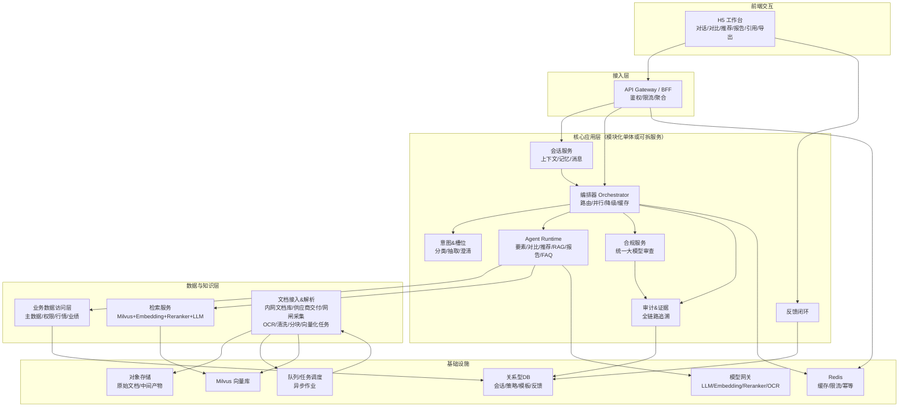

# 系统架构

<!-- 由 generate-architecture 命令或 system-architect / tech-architect skill 产出并维护 -->

## 系统上下文
### 系统定位
- **系统名称**：金融产品解析智能体（财富业务全场景智能问答与辅助决策）
- **核心用户**：银行客户经理；投研/产品内容供给方；合规/运营治理方
- **核心能力**：合规约束下的实时问答、产品要素解读、产品匹配推荐、多产品对比、研报/政策/内部投研摘要、周报/月报/解读稿生成，并提供“证据引用链路 + 审计追溯”。

### 外部系统与依赖（概念）
- **本系统用户与登录**：系统维护用户表（账号、密码哈希、姓名、工号、邮箱），用户采用账号+密码登录；登录后颁发 Token，业务请求携带 Token 解析出 userId（users.id）。可选后续对接统一身份/SSO 与现有用户打通。
- **产品与可售权限系统**：产品主数据、风险等级、期限、费率、投向、业绩基准、可售状态、权限隔离。
- **行情/业绩数据源**：基金净值、业绩表现、市场数据（如适用）。
- **文档与内容源**
  - 内部：投研报告、产品解读稿、内部政策解读、标准话术库。
  - 外部（入内网后使用）：行业研报、市场观点、监管政策等**由行内内容平台/供应商交付/网闸采集**进入内网文档库后供检索（系统本身不直连公网）。
- **模型与算力底座**：LLM、Embedding、Reranker、OCR；GPU/NPU 资源池。

### 架构驱动因素（来自 PRD 的硬约束）
- **合规**：必须具备输入/输出合规校验；敏感主题策略；可审计追溯（证据、版本、操作者）。
- **可追溯**：RAG/要素解读/推荐等输出需尽可能附带引用来源与证据片段。
- **性能**：关键交互 P95 ≤ 5s（需缓存/降级/异步处理协同）。
- **可扩展**：智能体与数据源可插拔；支持后续新增产品类型与新场景。
- **权限**：RBAC + 按产品池/数据源隔离；防越权检索与提示注入。
 - **全内网私有化部署**：不依赖公网服务；对外部内容采用“合规入库后使用”；关键系统需支持离线升级、内网证书与内网域名体系。

### 技术决策摘要（S1/S2/S3）
| 维度 | 决策 | 说明 |
|------|------|------|
| **S1 检索服务** | **LLM + Milvus + Embedding + Reranker** | 以 Milvus 为向量库、Embedding 向量化、Reranker 精排、LLM 基于检索结果生成回答；语义检索链路专用化，与技术架构图一致，回答质量与可扩展性更优。 |
| **S2 合规审查** | 统一大模型审查 | 输入/输出均经同一套 LLM 合规流程审查，规则与黑白名单作前置/兜底。 |
| **S3 证据与审计** | 冷热分层，保留 6 个月，支持审计导出 | 近期热数据可查，超期归档至冷存储；保留期满前可审批延长或销毁；支持按条件导出审计报告。 |

## 架构风格
### 一期推荐：模块化单体（Modular Monolith）+ 异步作业
- **原因**：需求面广但一期目标明确；单体便于快速交付、减少分布式复杂度；通过清晰模块边界与契约，保留未来拆分空间。
- **异步作业**：文档解析/向量化/索引刷新、评测与离线统计等使用队列/任务调度异步处理。

### 二期演进：按压力量级与团队边界拆分为服务
- **优先拆分候选**：文档处理/索引服务、检索服务、合规服务、智能体编排服务（或推理网关）、审计与观测服务。

### 架构模式组合
- **分层 + 端口适配器（Clean Architecture）**：交互层/应用层/领域层/基础设施层，外部依赖向内收敛。
- **策略模式 / 插件化**：意图识别路由、智能体注册与选择、合规策略、检索策略（BM25/向量/混合/重排）。
- **事件驱动（局部）**：文档入库→解析→向量化→索引更新→可检索的事件链路。

## 组件 / 微服务
> 下列为“逻辑组件”，一期可在同一代码仓内以模块形式实现；部署上可按需要拆进不同进程/服务。

### 交互与接入
- **H5 Web（前端）**
  - 多轮对话、产品选择/对比、推荐条件填写、报告模板选择与编辑、引用展示、导出/复制。
- **API Gateway **
  - 面向前端的聚合接口、鉴权与限流；避免前端直连内部多个模块。

### 核心应用层
- **Conversation Service（会话服务）**
  - 会话上下文、会话记忆（本会话产品与偏好）、会话状态机、消息持久化（可配置 TTL）。
- **Intent & Slot Service（意图识别与槽位抽取）**
  - 意图分类、槽位抽取、澄清问题生成（必要时）；对接路由策略引擎。
- **Orchestrator（任务编排/多智能体调度）**
  - 当前实现已演进为基金专项编排内核：`FundAgentRouter + Coordinator plan`，先任务规划，再按任务类型路由到业务 Agent 执行；多任务场景支持并行执行与结果融合。
  - 运行时能力包括：智能体选择、工具调用编排（数据查询、检索、抽取、生成）、超时与重试、并行化、降级与缓存策略。
  - 输出统一为“结构化响应 + 引用 + 风险提示 + 审计信息”，并支持流式进度事件与结构化结果事件透传给前端。
- **Agent Runtime（智能体运行时/插件）**
  - 标准化智能体接口（输入/输出 schema、可用工具、约束、成本与超时）。
  - 内置智能体：产品要素解读、对比、推荐、RAG 摘要、报告生成、FAQ/话术，说明如下：
    - **FAQ 问答智能体**
      - 典型流程：理解用户问题 → 在 FAQ 知识库中检索匹配 → 返回标准答案。
    - **RAG 智能体**
      - 典型流程：问题 → 检索文档 → LLM 生成回答（可结合重排与引用）。
    - **产品列表查询智能体**
      - 支持按用户意图查询产品列表/筛选产品，为后续解析/对比提供候选集。
    - **产品解读智能体**
      - 自动解析并解释各类理财/金融产品内容，输出结构化要点与风险提示等。
    - **产品对比智能体**
      - 将多款产品进行多维对比，生成结构化对比结果，帮助用户快速决策并发现差异。
    - **产品要素/条款抽取（解析）智能体**
      - 面向产品说明书/条款等内容抽取关键要素（如期限、费率、风险、赎回、收益规则等），用于解读/对比/校验。
    - **（客户问题/风险点）洞察智能体**
      - 结合用户行为与上下文识别潜在关注点/风险问题，辅助精准解释与追问澄清。
    - **智能报告生成智能体**
      - 基于市场信息与产品数据生成结构化报告，支持面向客户的投顾/财富管理场景输出。
    - **智能图谱构建智能体**
      - 自动构建、维护并更新行业研报/市场信息/产品要素等知识资产，增强可解释性与可追溯性。
    - **支持扩展智能体**
      - 通过插件化方式扩展更多业务智能体能力，降低新增场景成本。
- **意图与智能体/能力映射（核心应用场景落地的保证）**
  - **采用 AgentScope 时的编排方式**：多智能体框架为 [AgentScope](https://github.com/agentscope-ai/agentscope)（阿里开源），其理念是由**模型推理与工具调用**决定行为，而非僵化预设流程。因此「意图识别与槽位抽取」的结果应作为**上下文或提示**注入 AgentScope，由框架内的 **ReAct 智能体**（通过 Toolkit 注册的工具）或 **MsgHub 多智能体编排**在运行时**推理**决定：调用哪些工具/子智能体、以何种顺序协作。下表描述的是**可用能力与典型意图的对应关系**，用于（1）向 AgentScope 注册工具/能力清单、（2）设计系统提示或候选工具集约束、（3）合规与审计时解释“本次调用了哪些能力”，**而非**强制性的“意图→唯一主智能体”查表路由。
  - **可选混合策略**：若需兼顾合规与延迟，可将意图用于**缩小候选工具集**（例如仅暴露与该意图相关的工具），再由 AgentScope 在该子集内推理调用顺序与组合。
  - | 意图 | 对应能力/智能体 | 可选组合/子能力 | 前端入口 |
    |------|----------|------------------|-----------|
    | FAQ/标准话术 | FAQ 问答智能体 | — | POST /api/chat |
    | 研报/政策/观点摘要 | RAG 智能体 | Retrieval + LLM | POST /api/chat |
    | 产品列表/筛选 | 产品列表查询智能体 | Data Access（可售/权限） | POST /api/chat 或 GET /api/products/search |
    | 产品要素解读 | 产品解读智能体 | 产品要素抽取 + Data Access + 可选 RAG + LLM | POST /api/chat |
    | 多产品对比 | 产品对比智能体 | Data Access + 产品要素抽取 + LLM | POST /api/compare |
    | 按需求推荐产品 | 产品检索推荐智能体 | Data Access + LLM | POST /api/recommend |
    | 周报/月报/解读稿 | 智能报告生成智能体 | Retrieval + Data Access + 模板 + LLM | POST /api/report/generate |
    | 猜你想问/风险点洞察 | （客户问题/风险点）洞察智能体 | 会话上下文 + 行为 + LLM | 作为 POST /api/chat 响应中的 suggestedQuestions[] 或兜底建议 |
    | 条款/要素结构化抽取 | 产品要素/条款抽取智能体 | 文档解析 + LLM/规则 | 被解读/对比/报告智能体内部调用；或 Ingestion 侧文档入库时使用 |
  - **智能图谱构建智能体**：一期可不实现，保留扩展点；二期用于知识资产构建与可解释性增强。
  - **合规**：上述所有对用户可见输出均经 Compliance 输入/输出审查后再返回；审计记录每次调用的意图、**实际被调用的能力/工具**（由 AgentScope 推理产生）、数据源与证据。
- **Compliance Service（合规服务，S2 统一大模型审查）**
  - **统一采用大模型审查**：输入与输出均经同一套 LLM 合规模型/流程审查（敏感主题、承诺收益、夸大宣传、违规引导等），规则与黑白名单作为前置过滤或后置兜底。
  - 输出策略：拒答/改写/补充风险提示/强制引用来源/建议转人工；记录审查依据与模型版本，支持灰度与回滚。
- **Policy & Template Service（策略/模板）**
  - 合规策略、路由策略、报告模板、标准话术、对比维度模板等的版本管理。
- **Audit & Evidence Service（审计与证据）**
  - 全链路审计：请求、意图、数据源、检索证据片段、模型/策略版本、操作者、时间戳、输出摘要。
  - 支持抽检与合规审计查询。
- **Feedback Service（反馈闭环）**
  - “有用/无用/不准确”反馈、纠错建议、问题聚类，为评测与优化提供数据。

### 数据与知识层
- **Business Data Access Layer（业务数据访问层）**
  - 统一封装产品主数据、可售权限、行情与业绩等数据源；统一口径、权限校验、缓存、重试、熔断与观测。
  - 当前产品检索采用“双通道”策略：优先查询本地产品库（支持本地同步基金数据），本地无命中时回退到 `data_access` 统一接口，兼顾查询性能与多数据源扩展能力。
  - **多机构/多数据源差异的产品设计（如何统一封装）**
    - **问题**：不同银行或机构的产品主数据/可售权限/行情 API 的请求体、响应体、字段命名与结构均可能不同（机构 A 的 API 与机构 B 的 API 不一致），若编排层与智能体直接对接各家原始 API，会导致逻辑重复、难以扩展且无法统一权限与观测。
    - **做法：统一对“内”契约 + 按机构“适配器”对“外”**
      - **1）定义对内统一契约（领域模型与接口）**  
        业务数据访问层对上游（编排器、智能体）只暴露**一套**领域模型与接口，与“哪家机构”无关。例如：
        - **领域模型**：产品摘要（id、名称、类型、风险等级、期限、费率、投向、业绩基准、可售状态、来源机构等）、可售权限（用户/角色与产品池关系）、行情/业绩（产品 id、净值/收益率、日期等）。字段与类型由产品与合规需求统一约定，形成**标准产品模型（Canonical Product Model）**。
        - **统一接口**：如 `get_products(product_ids?, filters?, permission_context) → List[ProductSummary]`、`check_sale_permission(user_id, product_id) → bool`、`get_quotes(product_ids, date_range?) → List[Quote]`。所有调用方只依赖这些接口与标准模型，不关心底层是机构 A 还是 B 的 API。
      - **2）按机构实现适配器（Adapter），屏蔽外部差异**  
        每个银行/机构对应一个**适配器**（或连接器）：负责把**本系统的统一请求**转成该机构 API 的**请求体**，并把该机构 API 的**响应体**转成**本系统的标准领域模型**。例如：
        - 机构 A：请求体为 `{ "prodCodes": [...] }`，响应为 `{ "list": [ { "riskLevel": "R3", ... } ] }` → 适配器内做字段映射（如 `riskLevel` → 标准模型 `risk_level`），并处理分页、错误码与重试。
        - 机构 B：请求体为 `{ "productIds": [...] }`，响应为 `{ "data": [ { "risk_level": "中风险", ... } ] }` → 另一适配器做映射（如枚举值 "中风险" → 标准枚举 R3），同样输出标准模型。
      - **3）通过配置/注册表选择数据源**  
        根据当前请求的**租户/机构/产品池**（如从 `userId`、`productPoolIds` 或租户上下文解析出“当前机构 = 机构 A”），在运行时选择对应适配器；若某行同时对接多机构，可按产品池或数据源标签路由到不同适配器。新增一家机构时，仅**新增一个适配器实现 + 配置**，不改动编排层与智能体逻辑。
      - **4）在统一层做权限、缓存、观测**  
        权限校验（如可售范围、产品池）在统一层根据标准模型与 `permission_context` 完成，避免各适配器重复实现。缓存、重试、熔断与指标（按机构/接口维度）也集中在统一层，便于统一口径与运维。
    - **小结**：统一封装 = **对内统一领域模型与接口** + **对外按机构适配器翻译请求/响应** + **按租户/机构选择适配器** + **在统一层做权限/缓存/观测**。这样从产品设计上既满足“不同银行 API 各异”的差异性，又保证对业务与智能体侧“只面对一套语义”，便于扩展与维护。
- **Document Ingestion & Parsing（文档接入与解析）**
  - 文档接入（内部/外部）、OCR（如需）、解析与清洗、分块、元数据抽取、向量化任务生产。
- **Retrieval Service（检索服务，S1：LLM + Milvus + Embedding + Reranker）**
  - 用户检索内容的回答链路：**Embedding** 将 query 与文档向量化 → **Milvus** 做向量检索召回 → **Reranker** 精排 → **LLM** 基于 TopK 片段生成回答并附带引用。可选叠加关键词/结构化过滤（如 MySQL 或轻量全文）以满足精确匹配场景。
  - 引用片段截取与去重、按权限过滤与来源可信度标注由检索服务统一封装。
- **Evaluation & QA（评测与质量）**
  - 离线评测集管理、回归评测、关键指标产出（命中率、引用率、拒答率、准确性抽检等）。

### 基础设施
- **Model Gateway（模型网关/推理代理）**
  - 统一访问 LLM/Embedding/Reranker/OCR；配额、限流、熔断、路由（多模型选择）、日志与成本统计。
- **Queue/Job Scheduler（队列与任务调度）**
  - 文档处理、索引更新、离线评测、统计任务异步化。

## API 设计
> 详细 API 在 `technical_design.md` 展开；此处给出面向架构评审的“接口边界”。

### 前端（H5）对内的核心接口（示例边界）
- `POST /api/chat`：多轮对话入口（支持会话 id、上下文、产品选择、客户画像）；当前由 Coordinator 先规划任务，再路由到产品查询/解读/对比/其它能力；响应可含 `suggestedQuestions[]`（猜你想问）与 `structuredOutputs[]`。
- `GET /api/products/search` 或等价：产品列表/筛选（按类型、关键词、可售权限等），对应产品列表查询智能体；若一期全部走 chat 内路由也可，但需在意图与槽位中支持并返回结构化列表。
- `POST /api/compare`：多产品对比（产品集合 + 维度模板），对应产品对比智能体。
- `POST /api/recommend`：适配推荐（客户需求/风险偏好），对应产品检索推荐智能体。
- `POST /api/report/generate`：周报/月报/解读稿生成（模板 + 时间范围 + 主题），对应智能报告生成智能体。
- `GET /api/evidence/{answerId}`：引用与证据链路查询。
- `POST /api/feedback`：答案反馈与纠错。

### 内部服务接口（示例边界）
- Orchestrator → Data Access：产品要素查询、可售/权限校验、行情/业绩查询。
- Orchestrator → Retrieval：检索（query + filters + topK + 权限上下文）→ chunks + scores + citations。
- Orchestrator → Compliance：输入审查、输出审查（文本 + 结构化字段 + citations）→ decision + actions。
- Doc Ingestion → Queue：解析/向量化/索引更新任务投递。
- Audit：统一落库接口（append-only）+ 查询接口（按 answerId / user / 时间窗）。

### 契约与结构化输出（关键）
- 所有用户可见输出建议统一为：
  - `answerBlocks[]`（分块：摘要/要点/表格/风险提示）
  - `citations[]`（文档/段落/时间/可信度/权限标签）
  - `compliance`（策略版本、判定结果、是否拒答/是否改写）
  - `trace`（链路 id、模型版本、路由策略版本）
  - `suggestedQuestions[]`（可选）：猜你想问/洞察智能体输出的推荐问题列表，用于 chat 响应或流式 done 事件，便于前端快捷追问。
  - `structuredOutputs[]`（可选）：结构化业务结果（如基金分析卡片/图表/分段），用于前端组件化渲染。

### 流式事件契约（SSE，当前实现）
- 基础事件：`message_start`、`message_delta`、`citation`、`done`、`error`。
- 进度事件：`status`（用于展示“已受理/规划中/执行中/合规检查中”等阶段）。
- 结构化事件：`structured_update`（在最终 `done` 前推送结构化结果，降低前端等待时间）。
- 兼容策略：
  - 前端以 `message_delta` 作为正文流式增量来源。
  - `done` 事件中仍回传 `structuredOutputs[]` 作为最终兜底，避免中途事件丢失导致渲染不完整。

## 数据存储
### 结构化数据（OLTP）
- **关系型数据库（推荐）**
  - 会话/消息、模板与策略版本、智能体注册信息、反馈、任务状态、审计索引（审计正文可单独存）。
  - 选择：MySQL。
  - 当前会话消息持久化以 `content_summary` 为主；结构化输出（`structuredOutputs`）已在接口层透传，但未完全落入会话消息存储。后续应补齐“结构化输出持久化 + 会话恢复一致性”方案（可落 MySQL JSON 列或对象存储索引化）。

### 检索与知识（S1 方案决策：LLM + Milvus + Embedding + Reranker）
- **采用方案：LLM + Milvus + Embedding + Reranker 回答用户检索内容**
  - **回答链路**：用户 query → **Embedding 模型**向量化 → **Milvus** 向量检索召回候选 chunk → **Reranker 模型**精排 → **LLM** 基于 TopK 片段生成回答并输出引用来源；chunk 元数据（来源、权限、时间、可信度）存 Milvus 或关联存储，便于权限过滤与审计。
  - **理由**：语义检索与生成链路职责清晰；Milvus 专为向量场景设计，扩展性与检索性能优于通用引擎的 kNN；与 `docs/技术架构图.md` 中 Milvus + BGE + Reranker + LLM 的技术选型一致，便于落地与运维统一。
  - **实现要点**：文档入库时经 Embedding 向量化后写入 Milvus；检索服务对上游暴露统一接口（query + filters + topK + 权限上下文 → chunks + citations），内部封装 Milvus 查询、Reranker 调用与 LLM 生成；若业务需要强关键词/精确匹配，可叠加 MySQL 或轻量全文检索（如产品代码、条款编号等）。
- **向量与元数据**
  - 向量与 chunk 元数据（来源、权限、时间、标签、可信度）存 Milvus 或“Milvus + 关系表”关联；检索服务封装权限过滤与引用输出，对上游透明。

### 文档与对象存储
- **对象存储Minio（推荐）**
  - 原始文档（PDF/Word/图片）、解析中间产物（抽取文本、分块结果）与版本管理。

### 缓存与限流
- **Redis（推荐）**
  - 会话短期缓存、检索结果缓存、产品要素热点缓存、幂等键/速率限制、任务去重。

### 审计与日志（合规关键，S3 证据与审计留存策略）
- **证据与审计数据留存策略**
  - **冷热分层**：审计与证据数据采用冷热分层存储；近期数据可落关系库或热存储便于查询，超过一定时间（如 30 天）自动归档至冷存储（如对象存储/归档库）。
  - **保留周期**：**6 个月**；到期前可配置提醒与合规审批流程，超期数据按策略销毁或只读归档。
  - **审计导出**：支持按时间范围、用户、会话、回答 ID 等条件**导出审计报告**（含请求、意图、数据源、检索证据片段、生成版本、模型/策略版本、操作人、时间戳），满足内外部审计与合规检查。
- **存储实现建议**
  - 追加写表/索引（不可变）；冷数据以对象存储或归档库形式保存，并提供“按需恢复/查询”与导出接口。

## 部署架构
### 部署形态（推荐）
- **一期**：单体应用（含 Orchestrator/Agents/Data Access/Retrieval/Compliance 的模块化实现）+ 外部依赖（DB/Redis/向量库/对象存储/模型网关）+ 异步 Worker。
- **二期**：按模块拆服务（Retrieval、Compliance、Doc Processing、Model Gateway 等）并水平扩展。

### 网络与安全
- **全内网私有化部署约束**
  - 系统运行在内网/专网环境：**不直连公网**，不调用任何公网推理/存储/检索服务。
  - 外部研报/政策等内容通过行内“内容平台/供应商交付/网闸采集”进入内网文档库，形成可检索的合规数据源；保留来源、授权、入库时间与版本。
- **网络分区（建议）**
  - **业务区**：H5/BFF/核心应用（会话、编排、智能体运行时）。
  - **数据区**：业务数据访问层、关系库、Redis、向量库/检索库、对象存储。
  - **推理区**：模型网关与推理服务（LLM/Embedding/Reranker/OCR），GPU/NPU 资源池；与业务区通过受控接口访问。
  - **管理区**：运维、监控、审计查询与策略/模板管理后台（最小暴露面）。
- **统一鉴权与服务间安全**
  - 统一鉴权（SSO）+ 服务间 mTLS（条件允许时）。
  - 秘钥与证书通过行内密钥管理/证书体系下发与轮换（禁止硬编码）。
- **权限贯穿检索与数据访问**
  - 数据源与检索调用需携带权限上下文（用户、角色、产品池、数据源标签）。
  - 支持“检索前过滤（优先）”+ “检索后强过滤（兜底）”，并对过滤结果写入审计事件。
- **数据出境与泄露防护（建议）**
  - 禁止将受限原文/敏感字段写入可被非授权人员访问的日志与监控。
  - 对输出与引用做敏感内容再校验（DLP/合规规则），必要时仅展示“可公开摘要”而非原文片段。

### 伸缩与弹性
- 推理相关组件（模型网关/生成）按 GPU/NPU 资源弹性；文档处理 Worker 可独立扩缩。
- 对关键链路设置超时、重试与熔断；外部研报源不可用时降级为内部知识库/缓存摘要。

## 可观测性
### 日志
- 结构化日志（JSON）：`traceId`、`sessionId`、`answerId`、`userId`、`intent`、`agentPlan`、`dataSources`、`modelVersion`、`policyVersion`、`latencyMs`、`cacheHit`、`complianceDecision`。
- 严禁记录敏感明文（客户信息/受限内容）；必要字段脱敏。

### 指标（建议最小集）
- **体验类**：P50/P95 时延、超时率、失败率、缓存命中率、并发会话数。
- **RAG 类**：检索命中率、引用覆盖率、重排收益、chunk 去重率。
- **合规类**：拒答率、改写率、拦截率、误拦截率（通过抽检/标注集）、策略版本分布。
- **质量类**：反馈有用率、纠错率、离线评测得分（按场景）。
- **成本类**：token 消耗、单次请求成本、GPU 利用率。

### 链路追踪
- 端到端 trace：H5 → API → Orchestrator →（Data Access / Retrieval / Model Gateway / Compliance）→ Audit。
- 关键跨度：检索、重排、生成、合规审查、数据源调用分别打 span，便于定位 P95。
- 流式链路建议补充事件级观测：`message_start` 首包时间、`message_delta` 间隔、`structured_update` 到 `done` 间隔，用于定位前端“看起来卡住”问题。

## 架构图

## 合理性自检清单（你评审时可逐条打钩）
- **合规是否“前置+后置”**：输入审查（防提示注入/越权）与输出审查（承诺收益/夸大宣传/敏感主题）是否都存在？是否可配置/可灰度/可回滚？
- **权限是否贯穿检索链路**：检索过滤是否基于用户/产品池/数据源权限上下文？是否有“检索后强过滤 + 审计”兜底？
- **可追溯是否闭环**：每次回答是否可回放（数据源、检索 chunk、策略与模型版本、操作者）？引用展示与审计是否共用同一证据对象？
- **P95 ≤ 5s 是否有抓手**：并行化（数据查询+检索）、缓存（热点要素/检索结果/模板）、降级（外部源不可用）、超时与熔断是否明确？
- **模块边界是否支持演进**：Orchestrator、Retrieval、Compliance、Doc Processing、Model Gateway 是否都可独立拆分？
- **质量评测是否可落地**：是否定义离线评测集与线上反馈闭环，能支撑“准确率/引用率/拒答率”持续迭代？