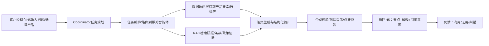
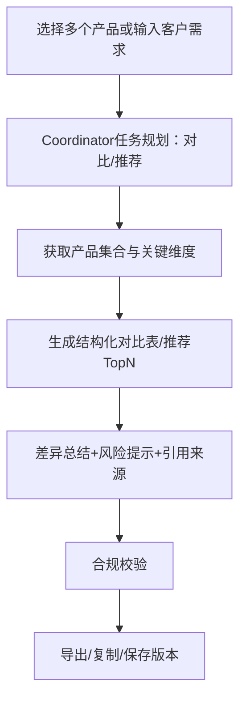

# 产品需求文档（PRD）

<!-- 由 generate-prd 命令或 product-manager / prd-generator skill 产出并维护 -->

## 产品概述
**产品名称**：财富业务全场景“金融产品解析智能体”（面向客户经理）

**一句话描述**：通过 H5 交互 + 任务规划编排（Coordinator）+ 记忆模块 + 多智能体协同，在合规约束下为银行客户经理提供实时、可追溯的产品要素解读、产品匹配与对比、研报/政策摘要以及周报月报等专业内容生成能力，显著提升销售沟通效率与客户体验。

**覆盖范围（一期目标）**
- 产品类型：理财产品、基金、保险、信托、专户等（可扩展）。
- 典型能力：产品要素实时解读、风险/期限/费率/投向/业绩基准解释、多产品横向对比（结构化对比表）、按客户需求与风险偏好检索适配产品、自动检索并摘要行业研报/市场观点/监管政策/内部投研报告、自动生成财富周报/月报/市场解读稿。

**业务背景**
- 第三方金融产品数量多、属性复杂、资料分散（产品说明书、条款、投研报告、监管政策、市场观点等），客户经理难以在客户沟通现场快速、准确回应“产品信息/风险等级/收益表现/对比选型”等高频问题。
- 金融领域对输出的合规性、准确性、可追溯性要求高，需要在智能生成的同时具备合规校验与证据引用链路。

**产品目标**
- 让客户经理“随问随答、答得准、答得稳、答得合规”，并能“快速对比、快速匹配、快速出稿”。
- 通过标准化知识沉淀与流程编排，形成可持续迭代的智能体能力体系。

## 目标用户
- **一线客户经理（核心用户）**
  - 场景：客户面谈/电话/线上沟通；售前准备；售中答疑；投后解释。
  - 诉求：快速给出清晰、合规、可引用的答案；快速完成多产品对比与推荐备选；快速生成专业内容。
- **投研/产品经理（内容供给方）**
  - 场景：投研报告、产品解读稿、要素标准维护；知识库更新。
  - 诉求：高效沉淀内容、可控发布、可追溯引用；通过反馈闭环提升质量。
- **合规/风控/运营（治理与审计）**
  - 场景：合规策略配置、敏感风险提示、审计抽检、黑白名单。
  - 诉求：输出可控、可审计；风险可提前拦截；数据权限隔离明确。

## 用户故事
- **US-01**：作为客户经理，我在与客户沟通时输入“这只基金的风险等级、费率、业绩基准是什么？适合什么风险偏好？”系统在 5 秒内给出结构化要点、风险提示与引用来源。
- **US-02**：作为客户经理，我选择两到三只产品，系统自动生成结构化对比表（风险/期限/费率/投向/业绩基准/赎回规则/适配客群等），并突出差异点与注意事项。
- **US-03**：作为客户经理，我输入客户的需求（期限、流动性、风险偏好、目标收益、偏好行业等），系统从可售产品池中检索并给出 TopN 适配产品及推荐理由（含约束与引用）。
- **US-04**：作为客户经理，我需要“最近一周市场怎么走、监管有什么新口径、有哪些重点研报观点？”系统自动检索外部/内部资料并摘要成可对客户解释的话术。
- **US-05**：作为客户经理，我一键生成财富周报/月报/市场解读稿，支持按“分块—可编辑—可复用模板”输出，并可在 H5 中复制/导出。
- **US-06**：作为合规人员，我可以配置敏感主题与输出策略（拒答/改写/提示/引用要求），并能在审计面板查看一次回答的“数据来源 + 检索证据 + 生成版本 + 操作人”。
- **US-07**：作为投研人员，我上传/发布一份内部投研报告后，系统在后台完成解析入库与向量化，并在 RAG 问答时可被检索引用。

## 功能需求
### 4.0 用户与登录（业务需求）
- **用户表**：系统维护用户主数据，包含登录账号、密码（存储为哈希）、用户姓名、工号、邮箱等信息。
- **登录方式**：用户采用**账号+密码**登录系统；登录成功后获得 Token，后续请求携带 Token 作为身份凭证。
- **扩展**：后续可对接企业 SSO/统一身份，与现有用户表打通或联邦。

### 4.1 前端 H5 交互（客户经理工作台）
- **多轮对话问答**
  - 支持追问澄清、上下文承接、会话内记忆与“引用来源”展示。
  - 支持一键插入常用问题、快捷选择产品、快捷选择客户画像/风险偏好。
- **产品对比**
  - 选择多个产品（\(N\ge2\)）生成结构化对比表。
  - 支持自定义对比维度、差异高亮、导出/复制。
- **产品检索与推荐**
  - 支持按需求与风险偏好检索适配产品（筛选 + 排序 + 推荐理由）。
  - 支持“不可售/权限不足/不适配”提示与替代建议。
- **研报/政策/观点摘要**
  - 支持输入主题或时间范围，输出摘要、要点、关键引用与结论。
- **周报/月报/解读稿生成**
  - 模板化（可选：周报、月报、市场解读、产品解读稿等），分块输出（标题/摘要/要点/风险提示/参考来源）。
  - 支持在线编辑与版本保存（最小可用：生成后复制导出）。

### 4.2 任务规划与路由
- **任务规划**
  - 根据用户问题生成执行计划（单任务/多任务），覆盖：产品要素解读、产品对比、产品检索推荐、研报摘要、政策解读、报告生成、其它问题等。
- **上下文提取**
  - 提取并利用：产品名称/代码、产品类型、时间范围、对比维度、客户画像（期限/风险/流动性/收益目标等）。
- **路由策略**
  - 由 Coordinator 将计划路由到对应业务智能体；多任务场景支持并行执行与结果融合（如：产品查询 + 对比 + 合规校验）。

### 4.3 记忆模块
- **会话记忆**
  - 保留本次会话中的产品选择、客户偏好、已澄清的约束条件，用于后续问答与推荐。
- **用户偏好（可选一期）**
  - 记忆客户经理常用模板/常查产品/常用维度（需权限与隐私策略）。

### 4.4 多智能体协同（能力清单）
- **产品要素解读智能体**
  - 输入：产品标识 + 问题；输出：风险等级、期限、费率、投向、业绩基准等结构化要点 + 解释 + 引用。
- **多产品对比智能体**
  - 输入：产品集合 + 对比维度；输出：结构化对比表（可导出）+ 差异总结 + 风险提示。
- **产品检索推荐智能体**
  - 输入：客户需求/风险偏好；输出：TopN 产品 + 推荐理由 + 不适配说明 + 引用/依据。
- **RAG 智能体（研报/政策/观点）**
  - 输入：主题/问题；输出：摘要/要点/结论 + 引用来源（文档标题、段落片段、时间）。
- **报告生成智能体**
  - 输入：模板 + 时间范围 + 主题；输出：周报/月报/市场解读稿分块内容 + 引用。
- **知识图谱/知识沉淀（可后续增强）**
  - 自动抽取实体关系（产品—资产—行业—风险—政策），提升可解释与检索质量（一期可不做图谱落地，保留接口）。

### 4.5 数据与知识接入
- **产品主数据/行情与业绩数据**
  - 统一接口访问：产品基础信息、风险等级、期限、费率、投向、业绩基准、历史表现（如有）、可售状态等。
- **文档与知识库**
  - 支持：行业研报、市场观点、监管政策、内部投研报告、产品说明书/条款等文档接入。
  - 处理：解析 → 分块 → 向量化 → 入库 → 可检索引用。

### 4.6 合规与风控（强约束）
- **输入输出合规校验**
  - 敏感主题识别（监管红线、承诺收益、夸大宣传、违规引导等）。
  - 输出策略：拒答/改写/补充风险提示/强制引用来源/建议转人工。
- **可追溯与审计**
  - 每次输出记录：请求、意图、使用的数据源、检索证据片段、生成版本、模型版本、操作人、时间戳。

### 4.7 运营与治理（一期最小集）
- **知识库管理**
  - 文档上传/发布/下线；更新触发重新向量化；标签与分类管理。
- **模板管理**
  - 周报/月报/解读稿模板的创建与版本管理（一期可先内置固定模板）。
- **质量反馈闭环**
  - 客户经理可对答案“有用/无用/不准确”反馈并补充原因（用于迭代与评测）。

## 非功能需求
### 性能
- **响应时延**：关键交互（问答/对比/推荐）P95 ≤ 5s（不含外部数据源不可控延迟的兜底策略需定义）。
- **并发能力**：支持至少 200 并发会话（一期目标，可按资源弹性扩展）。
- **可用性**：月可用性 ≥ 99.5%（一期），关键依赖降级策略明确（如外部研报源不可用时降级到内部知识库）。

### 安全
- **身份认证与权限控制**：本系统维护用户表，支持账号+密码登录；按角色（客户经理/投研/合规/运营）RBAC；按数据源/产品池权限隔离。可选后续对接企业 SSO/统一身份。
- **数据保护**：传输加密（TLS）；敏感字段脱敏；日志与审计数据加密存储；最小权限访问。
- **内容安全**：防提示注入（prompt injection）与越权检索；对外部文档来源进行可信度标注与黑名单控制。

### 可扩展性
- **智能体可插拔**：新增产品类型/新场景智能体不影响既有链路；通过注册表/路由配置扩展。
- **数据源可插拔**：支持新增外部接口、数据库、文件源；具备重试、限流、缓存与熔断能力。

### 可观测性与可运维
- **日志/指标/链路追踪**：全链路可观测；关键指标包括：命中率、引用率、拒答率、合规拦截率、P95 时延、失败率。
- **灰度与回滚**：模型/策略/模板变更支持灰度发布与快速回滚。

## 用户流程
### 典型流程 A：产品要素问答（现场沟通）

### 典型流程 B：多产品对比与推荐

## 成功指标
### 业务指标
- **覆盖率**：重点产品类型（理财/基金/保险/信托/专户）核心要素覆盖 ≥ 90%（以字段可获取与可解释为准）。
- **效率提升**：客户经理单次答疑平均耗时降低 ≥ 50%；“准备材料”时间降低 ≥ 30%。
- **使用与留存**：周活跃客户经理数、日均会话数、周报/月报生成次数持续增长（具体阈值在试点后设定）。

### 质量指标
- **准确性（抽检）**：产品要素问答准确率 ≥ 95%（抽检口径：字段一致 + 解释不误导）。
- **可追溯性**：需要引用的回答中，引用来源覆盖率 ≥ 90%，且引用与结论一致。
- **用户满意度**：回答“有用”反馈率 ≥ 80%（试点期可调）。

### 合规指标
- **合规拦截有效性**：对敏感/违规输出拦截召回率 ≥ 99%（以合规模型/规则评测集为准）。
- **重大合规事故**：0 起（目标）。

