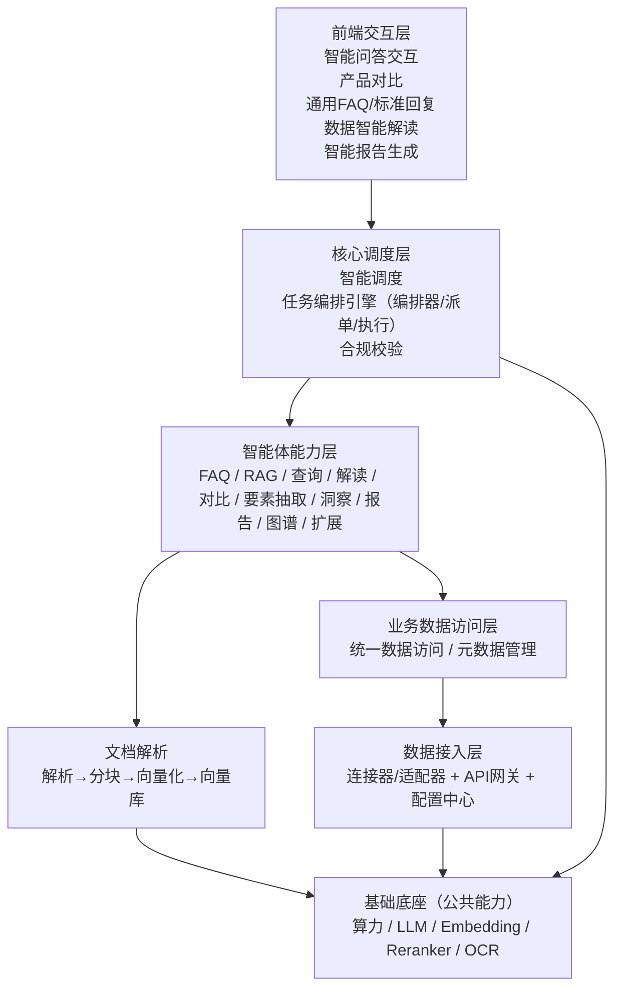

# 金融产品解析智能体功能架构图（解析版）

> 说明：本文根据 `docs/金融产品解析智能体功能架构图.jpg` 的内容整理为可维护的 Markdown 版本，便于评审、落地与持续演进。

## 1. 总体分层

- **前端交互层**：面向用户提供问答、对比、解读、报告等入口。
- **核心调度层**：负责多智能体任务编排、派单执行与合规校验。
- **智能体能力层**：提供面向金融产品解析的一组可插拔智能体能力（FAQ/RAG/解读/对比/要素抽取/报告等）。
- **业务数据访问层**：统一业务数据访问与元数据管理，为智能体提供一致的数据入口。
- **数据接入层 & 文档解析**：将外部/内部数据与文档沉淀为可被检索与调用的结构化/向量化资产。
- **基础底座（公共能力层）**：算力、LLM、Embedding、Reranker、OCR 等通用能力。

## 2. 前端交互层

- **智能问答交互**
  - 支持多轮对话式交互，覆盖金融产品相关问答与咨询场景。
- **产品对比**
  - 支持多产品的多维度对比，辅助用户决策。
- **通用 FAQ 问答 / 标准回复模板**
  - 基于 FAQ 知识库与标准化话术，输出稳定一致的答案。
- **数据智能解读**
  - 对金融数据/指标/内容进行智能解释与总结，降低理解成本。
- **智能报告生成**
  - 自动生成结构化报告（如市场/财富管理相关报告），便于分发与留存。

## 3. 核心调度层

- **智能调度（智能体池/能力编排入口）**
  - 面向上层交互请求，选择合适的智能体能力组合进行处理（可插拔、可扩展）。
- **任务编排引擎（多智能体协作）**
  - 在多个智能体之间选择合适的智能体并安排执行任务。
  - 关键能力（图中按钮）：**编排器**、**派单 Agent**、**执行器**。
- **合规校验**
  - 对金融领域输入/输出进行安全、合法、合规校验与拦截。

## 4. 智能体能力层（按图中模块整理）

> 该层为“能力组件化”的核心：每个智能体聚焦一个职责，通过调度/编排组合成完整业务流程。

- **FAQ 问答智能体**
  - 典型流程：理解用户问题 → 在 FAQ 知识库中检索匹配 → 返回标准答案。
- **RAG 智能体**
  - 典型流程：问题 → 检索文档 → LLM 生成回答（可结合重排与引用）。
- **产品列表查询智能体**
  - 支持按用户意图查询产品列表/筛选产品，为后续解析/对比提供候选集。
- **产品解读智能体**
  - 自动解析并解释各类理财/金融产品内容，输出结构化要点与风险提示等。
- **产品对比智能体**
  - 将多款产品进行多维对比，生成结构化对比结果，帮助用户快速决策并发现差异。
- **产品要素/条款抽取（解析）智能体**
  - 面向产品说明书/条款等内容抽取关键要素（如期限、费率、风险、赎回、收益规则等），用于解读/对比/校验。
- **（客户问题/风险点）洞察智能体**
  - 结合用户行为与上下文识别潜在关注点/风险问题，辅助精准解释与追问澄清。
- **智能报告生成智能体**
  - 基于市场信息与产品数据生成结构化报告，支持面向客户的投顾/财富管理场景输出。
- **智能图谱构建智能体**
  - 自动构建、维护并更新行业研报/市场信息/产品要素等知识资产，增强可解释性与可追溯性。
- **支持扩展智能体**
  - 通过插件化方式扩展更多业务智能体能力，降低新增场景成本。

## 5. 业务数据访问层

- **统一数据访问 / 元数据管理**
  - 智能体所需的业务数据统一通过该访问层调用与回流（图中示例：理财、保险、基金等）。
  - 目标：统一口径、权限控制、可观测与可治理。

## 6. 数据接入层

- **外部数据接入**
  - 以连接器/适配器 + API 网关 + 配置中心为主，配合缓存与重试策略。
  - 支持多源数据接入与可插拔扩展。
  - 接入形态（图中按钮）：**业务接口**、**数据库/文件**、**API**。

## 7. 文档解析

- 以通用解析 → 分块 → 向量化 → 向量库 为主，结合任务调度能力，支撑 RAG 知识库构建与更新。
- 关键组件（图中按钮）：**解析引擎**、**向量化**、**向量库**。

## 8. 基础底座（公共能力层）

- **算力资源**：GPU、NPU
- **LLM 模型（大语言模型）**：Qwen1.5-32B、DeepSeekV3（按图示）
- **Embedding 模型**：bge-m3、bge-large-zh
- **Reranker 模型**：bge-reranker-large
- **OCR 模型**：MinerU、PaddleOCR

## 9. 端到端关系图（Mermaid）

## 10.（建议）下一步落地要点

- **S1 稳定性/可扩展性**：为“任务编排引擎”定义标准化的智能体接口（输入/输出 schema、超时与重试、幂等键、可观测字段），并将智能体注册/路由做成可配置化。
- **S2 性能/安全**：在合规校验前后加入输出分级与敏感信息策略（脱敏/拒答/引用来源），RAG 检索链路采用 rerank + 缓存提升命中与延迟表现。
- **S3 可维护性**：把智能体能力按“领域边界”拆成独立模块目录（FAQ、RAG、解析、对比、报告），并建立统一的评测集与回归基线。
- **进一步验证**：明确各智能体依赖的数据源清单与权限模型；对“报告生成/数据解读”定义可度量的质量指标（准确率、可追溯引用率、合规拦截率、用户满意度）。

