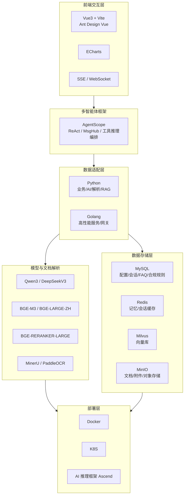

# 金融产品解析智能体技术架构图（解析版）

> 说明：本文根据 `docs/金融产品解析智能体技术架构图.png` 整理为可维护的 Markdown 版本，便于与 `.cursor/memory/architecture.md`、PRD 对照及后续实现。

## 1. 总体分层

技术架构自顶向下分为六层：前端交互层 → 多智能体框架 → 数据适配层 → 数据存储层 → 模型与文档解析 → 部署层。

---

## 2. 前端交互层

| 技术/能力 | 用途 |
|-----------|------|
| **Vue3** | 渐进式前端框架，构建 H5 工作台（对话、对比、推荐、报告、引用展示）。 |
| **Vite** | 现代前端构建工具，提升开发与构建速度。 |
| **Ant Design Vue** | 企业级 UI 组件库，保证界面规范与可复用性。 |
| **ECharts** | 图表与数据可视化，用于产品对比、市场解读、报告中的图表展示。 |
| **SSE（Server-Sent Events）** | 服务端到客户端的单向推送，用于流式输出（如问答/报告生成进度与分块返回）。 |
| **WebSocket** | 全双工实时通信，用于即时问答、会话状态同步、实时通知。 |

---

## 3. 多智能体框架

| 技术/能力 | 用途 |
|-----------|------|
| **AgentScope** | 阿里开源的多智能体框架（[GitHub](https://github.com/agentscope-ai/agentscope)、[中文 README](https://github.com/agentscope-ai/agentscope/blob/main/README_zh.md)）。提供 ReAct 智能体、Toolkit 工具注册、MsgHub 多智能体消息编排等；**由模型推理与工具调用**决定“调用哪些能力、以何种顺序协作”，而非固定意图查表路由。意图识别结果作为上下文或候选工具集注入，对应架构中的 Orchestrator + Agent Runtime。 |

---

## 4. 数据适配层

| 技术/能力 | 用途 |
|-----------|------|
| **Python** | 业务逻辑、AI 推理调用、文档解析与向量化、RAG/检索、数据清洗与集成；与 LLM/Embedding/Reranker/OCR 等模型对接。 |
| **Golang（Go）** | 高性能服务、API 网关、数据管道、高并发会话与缓存访问等对延迟和吞吐敏感模块。 |

---

## 5. 数据存储层

| 存储 | 用途 |
|------|------|
| **MySQL** | 系统配置数据、会话日志、FAQ 库、合规规则等结构化数据。 |
| **Redis** | 短时/长时记忆、会话上下文缓存、热点数据缓存、限流与幂等。 |
| **Milvus** | **向量库**：存储文档与查询的向量表征，支撑语义检索与 RAG；与 Embedding 模型配合。 |
| **MinIO** | 对象存储（S3 兼容）：文档原文、附件、解析中间产物及冷数据归档。 |

---

## 6. 模型与文档解析

| 类型 | 技术/模型 | 用途 |
|------|-----------|------|
| **LLM** | Qwen3 / DeepSeekV3 | 问答生成、报告生成、合规审查（统一大模型审查）、摘要与解读。 |
| **Embedding** | BGE-M3 / BGE-LARGE-ZH | 文本向量化，用于语义检索与 RAG 入库。 |
| **Reranker** | BGE-RERANKER-LARGE | 对检索结果重排序，提升召回的准确性与引用质量。 |
| **OCR** | MinerU / PaddleOCR | 文档图像理解、表格结构识别、扫描件/图片中的文字抽取。 |

---

## 7. 部署层

| 技术/能力 | 用途 |
|-----------|------|
| **Docker** | 容器化封装应用与依赖，保证环境一致性与内网离线部署。 |
| **K8S（Kubernetes）** | 容器编排、弹性伸缩、服务发现与发布，支撑全内网私有化部署。 |
| **AI 推理框架：Ascend** | 基于华为昇腾（NPU）的推理框架，为 LLM/Embedding/Reranker/OCR 提供算力，满足内网私有化与国产化要求。 |

---

## 8. 技术架构关系图（Mermaid）

---

## 9. 与架构决策的对应关系

| 架构文档中的决策 | 技术架构图中的体现 |
|------------------|---------------------|
| **检索方案（S1）** | 与 `architecture.md` 一致：采用 **LLM + Milvus + Embedding + Reranker** 回答用户检索内容。图中 **Milvus** 为向量库，**BGE-M3/BGE-LARGE-ZH** 为 Embedding，**BGE-RERANKER-LARGE** 为精排，**Qwen3/DeepSeekV3** 为生成回答的 LLM。 |
| 全内网私有化部署 | Docker + K8S + Ascend 推理框架，无公网依赖，适合内网与国产化环境。 |
| 统一大模型审查（S2） | Qwen3/DeepSeekV3 可用于合规审查链路。 |
| 证据与审计（S3） | MySQL 存会话与合规规则，Redis 做会话缓存，审计与证据可通过 MySQL + MinIO 冷分层实现 6 个月保留与导出。 |

---

## 10. 说明与后续建议

- 本技术架构图侧重**技术选型与分层**，与 `.cursor/memory/architecture.md` 中的**逻辑组件与数据流**互补：架构定义“做什么、边界在哪”，技术架构定义“用什么实现”。
- **S1 检索链路**：用户 query → Embedding（BGE）→ Milvus 向量检索 → Reranker（BGE-RERANKER-LARGE）精排 → LLM（Qwen3/DeepSeekV3）生成回答与引用，与架构文档中的决策一致。
- 前端 SSE/WebSocket 与后端 Agent Scope、Python/Go 的接口契约（流式协议、消息格式）建议在 `technical_design.md` 中细化。
